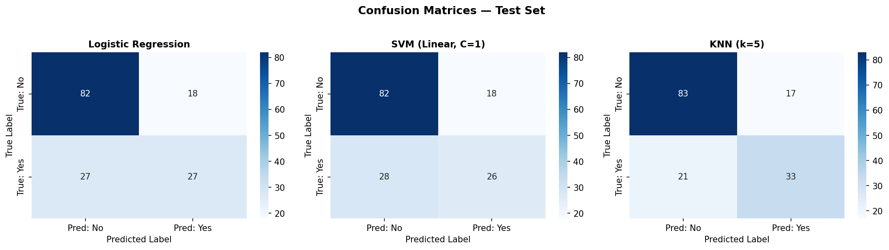
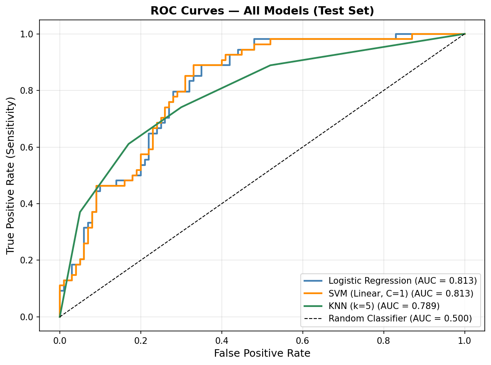
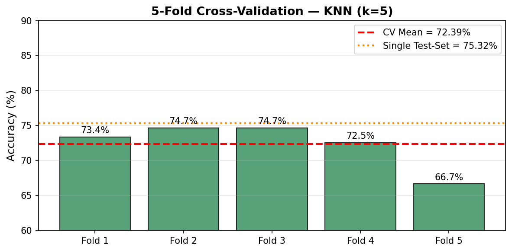

# Biomedical Data Analytics — Assignment 2
## Machine Learning Classification on Pima Indians Diabetes Dataset

| | |
|:---|:---|
| **Course** | Biomedical Data Analytics |
| **Institution** | Cairo University — Faculty of Engineering |
| **Student Name** | Mahmoud Mohamed Abdelfattah |
| **Student ID** | 4220142 |
| **Date** | 12 May 2026 |

---

## Dataset

| Property | Details |
|:---|:---|
| **Name** | Pima Indians Diabetes Database |
| **Source** | [Kaggle — UCI Pima Indians Diabetes](https://www.kaggle.com/datasets/uciml/pima-indians-diabetes-database) |
| **File** | `diabetes.csv` |
| **Rows** | 768 |
| **Columns** | 9 (8 features + 1 target) |
| **Target Variable** | `Outcome` — 0 = No Diabetes, 1 = Diabetes |
| **Task** | Binary Classification |

### Features

| # | Feature | Description |
|---|---------|-------------|
| 1 | Pregnancies | Number of times pregnant |
| 2 | Glucose | Plasma glucose concentration (2-hr OGTT) |
| 3 | BloodPressure | Diastolic blood pressure (mm Hg) |
| 4 | SkinThickness | Triceps skin fold thickness (mm) |
| 5 | Insulin | 2-hour serum insulin (μU/mL) |
| 6 | BMI | Body mass index (kg/m²) |
| 7 | DiabetesPedigreeFunction | Genetic predisposition score |
| 8 | Age | Patient age (years) |
| 9 | Outcome | Diabetes diagnosis — **target** |

---

## Project Structure

```
Assignment-2/
├── Assignment2_Diabetes_ML.ipynb    # Main ML notebook
├── diabetes.csv                     # Pima Indians Diabetes dataset
├── requirments.md                   # Assignment specification
├── README.md                        # This file
└── screenshots/
    ├── 01_confusion_matrices.png    # Confusion matrices for all 3 models
    ├── 02_roc_curves.png            # ROC curves comparison
    └── 03_cross_validation.png      # 5-fold CV accuracy per fold
```

---

## Notebook Structure

### Part 1 — Data Preparation
- **Missing value handling:** Biologically impossible zeros in `Glucose`, `BloodPressure`, `SkinThickness`, `Insulin`, and `BMI` replaced with column medians computed on non-zero rows.
- **Train/Test split:** 80% train / 20% test using `train_test_split` with `stratify=y` and `random_state=42`.
- **Feature scaling:** `StandardScaler` fit on the training set only, then applied to both sets (no data leakage).

### Part 2 — Model Training

| Model | Algorithm | Key Parameters |
|:------|:----------|:---------------|
| Logistic Regression | Linear, probabilistic | `max_iter=1000`, `random_state=42` |
| SVM | Linear kernel, max-margin | `C=1.0`, `kernel='linear'` |
| KNN | Instance-based, k-NN | `n_neighbors=5` |

**SVM C parameter analysis:**
- `C=0.01` → Training accuracy: 78.34%
- `C=1.0` → Training accuracy: 78.66% *(chosen)*

**LR top coefficients:**
- Strongest positive: `Glucose` (+1.1826) — higher glucose strongly raises diabetes risk
- Strongest negative: `Insulin` (−0.0663) — higher insulin slightly lowers predicted risk

### Part 3 — Model Evaluation (Test Set)

| Model | Accuracy | Precision | Recall | F1-Score | Specificity | AUC |
|:------|:--------:|:---------:|:------:|:--------:|:-----------:|:---:|
| Logistic Regression | 0.7078 | 0.6000 | 0.5000 | 0.5455 | 0.8200 | 0.8130 |
| SVM (Linear, C=1) | 0.7013 | 0.5909 | 0.4815 | 0.5306 | 0.8200 | 0.8131 |
| **KNN (k=5)** | **0.7532** | **0.6600** | **0.6111** | **0.6346** | **0.8300** | 0.7886 |

**Best model: KNN (k=5)**
- Highest Accuracy (75.3%), Precision (0.66), **Recall (0.611)**, F1 (0.635), and Specificity (0.83).
- **Recall is the most clinically critical metric** — KNN correctly identifies 61% of all diabetic patients vs 50% for LR and 48% for SVM.
- LR/SVM have marginally higher AUC (0.813), but KNN is superior at the standard 0.5 decision threshold.

### Part 4 — Cross-Validation (KNN, 5-fold)

| | Value |
|:---|:---|
| Fold 1 | 73.38% |
| Fold 2 | 74.68% |
| Fold 3 | 74.68% |
| Fold 4 | 72.55% |
| Fold 5 | 66.67% |
| **CV Mean** | **72.39%** |
| **CV Std** | **2.97%** |
| Single Test-Set | 75.32% |
| Difference | 2.93 pp |

Cross-validation gives a more reliable estimate because it averages over 5 different test partitions (reducing variance), uses all data for validation (maximising information use), and the standard deviation quantifies model stability — a key concern when deploying models in clinical settings with limited data.

---

## Screenshots

### Confusion Matrices


### ROC Curves


### Cross-Validation (KNN)


---

## How to Run

1. Open `Assignment2_Diabetes_ML.ipynb` in VS Code or JupyterLab.
2. Ensure `diabetes.csv` is in the same directory.
3. Install dependencies: `pip install numpy pandas matplotlib seaborn scikit-learn`
4. Run all cells in order (Kernel → Restart & Run All).

### Dependencies

| Package | Version |
|:--------|:--------|
| Python | ≥ 3.9 |
| numpy | ≥ 1.24 |
| pandas | ≥ 2.0 |
| matplotlib | ≥ 3.7 |
| seaborn | ≥ 0.12 |
| scikit-learn | ≥ 1.3 |

---

## Key Findings

1. **Data quality:** 48.7% of Insulin values and 29.6% of SkinThickness values were impossible zeros — a critical preprocessing challenge common in real clinical datasets.
2. **Best model:** KNN (k=5) outperforms LR and SVM on all point-estimate classification metrics.
3. **Clinical priority:** Recall is the most important metric for diabetes screening. KNN's 61% recall means it catches 22% more diabetic patients than Logistic Regression.
4. **Generalisation:** 5-fold CV mean of 72.4% (±3%) is close to the test-set accuracy of 75.3%, confirming the model is stable.
5. **LR interpretability:** Glucose is the strongest predictor of diabetes (coefficient +1.18), consistent with clinical knowledge.
